# 📋 𝐂𝐋𝐀𝐒𝐒𝐒𝐂𝐀𝐍
### *𝚠𝚑𝚎𝚛𝚎 𝚎𝚟𝚎𝚛𝚢 𝚜𝚌𝚊𝚗 𝚌𝚘𝚞𝚗𝚝𝚜, 𝚊𝚗𝚍 𝚎𝚟𝚎𝚛𝚢 𝚙𝚛𝚎𝚜𝚎𝚗𝚌𝚎 𝚖𝚊𝚝𝚝𝚎𝚛𝚜!*

[](https://github.com/DanRyuzaki)
[](https://github.com/DanRyuzaki/ClassScan)
[](https://github.com/DanRyuzaki/ClassScan/fork)
[](https://www.apache.org/licenses/LICENSE-2.0)
[](https://github.com/DanRyuzaki/ClassScan/releases/tag/v1.0.0)

---

**CLASSSCAN** is a Flutter Web-based QR attendance system built as a Progressive Web Application (PWA+SPA) for classroom use in schools. Developed as part of a STEM capstone research paper at Our Lady of Fatima University — Quezon City Campus (A.Y. 2025–2026), ClassScan digitizes classroom attendance, eliminates manual errors, and enforces a four-layer anti-proxy system to prevent fraudulent check-ins. All system development and implementation were carried out by a single contributor — **SoliDeoCode**.

### ✦ Key Features
- **Teacher Portal** — Manage classes, enroll students, configure attendance rules, and monitor sessions live from a dedicated dashboard
- **Kiosk Scanner** — A standalone QR scanning station that handles student time-in and time-out; runs anonymously with no login required
- **Student Portal** — Students access their daily personal QR code, join classes by code, and view their enrollment status
- **Four-Layer Anti-Proxy System** — Date-bound QR codes, teacher verification, optional GPS proximity validation, and device scan cooldown work together to make proxy attendance extremely difficult
- **Real-Time Session Monitoring** — Live attendance updates pushed to the teacher dashboard the moment a student scans at the kiosk
- **Configurable Attendance Rules** — Per-class settings for on-time window, scan cooldown, time-out minimum, and GPS proximity threshold
- **Automated Status Computation** — Attendance statuses (Present On-Time, Present Late, Absent) are calculated automatically based on session start time
- **Excel & CSV Export** — One-tap export of any session's attendance records; unverified sessions produce a CSV fallback to ensure no data is ever lost
- **Ghost Session Cleanup** — Unverified sessions older than 12 hours are automatically deleted to keep the database clean
- **Remote Session Control** — Teachers can force-end any live kiosk session directly from the dashboard; the kiosk is notified in real-time
- **Single-Device Enforcement** — Students can only be signed in on one device at a time; concurrent sessions are automatically invalidated
- **Email Domain Restriction** — Teachers can restrict class enrollment to specific institutional email domains (e.g. `fatima.edu.ph`)

---

## ✮ Project Background

This system was developed as part of a **STEM Capstone Research Paper** titled:

> ***"Web-Assisted Attendance Monitoring System with Classroom-Based QR Scanner"***

Led by **Grade 12 STEM 12 1-1P** students of **Our Lady of Fatima University — Quezon City Campus**, Academic Year 2025–2026:

| Role | Name |
|------|------|
| Head Proponent | Yulde, Jin Deca R. |
| Co-Researcher | Aggabao, Olivia C. |
| Co-Researcher | Añabieza, Maury Joahna B. |
| Co-Researcher | Carmona, Rhevie Yvonne M. |
| Co-Researcher | De Guzman, Princess S. |
| Co-Researcher | Estoque, Francisco Light S. |
| Co-Researcher | Maningas, Sebastian Kaidar M. |
| Co-Researcher | Maragay, Khellie Arvey C. |
| Co-Researcher | Musñgi, Sunshine C. |
| Co-Researcher | Suapengco, Azeriah Jedi V. |

---

## 🖳 Technologies

  

### Core Framework
- **Flutter Web (Dart)** — Cross-platform PWA development targeting modern browsers

### Backend & Services
- **Firebase Firestore** — Real-time cloud database for sessions, classes, and attendance records
- **Firebase Authentication** — Google Sign-In for teachers and students; anonymous auth for the kiosk
- **Google Sign-In / Google Sign-In Web** — Institutional account authentication

### Key Packages
- `mobile_scanner` — QR code scanning via device camera
- `qr_flutter` — QR code generation for teacher and student identity tokens
- `cloud_firestore` — Firestore SDK for real-time data sync
- `firebase_auth` — Authentication state management
- `provider` — State management via `ChangeNotifier`
- `excel` — In-browser Excel (.xlsx) file generation and export
- `geolocator` — GPS coordinate retrieval for location-based attendance validation
- `toastification` — Toast notification system for real-time feedback
- `hugeicons` — Icon library
- `animate_on_hover` — Hover micro-interactions
- `web` — Dart web interop for browser-native file downloads

---

## ⿻ Screenshots

| [ ◉¯] | [ ◉¯] |
|----------|----------|
| 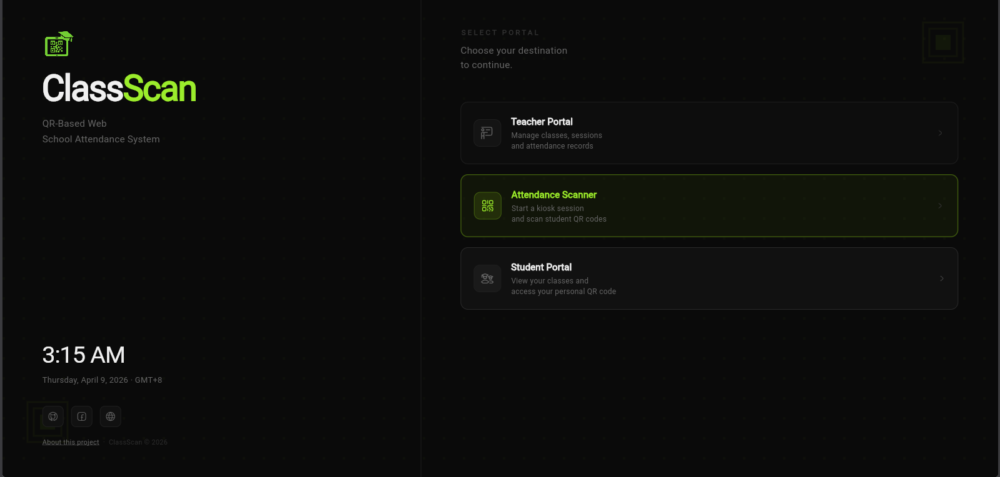 | 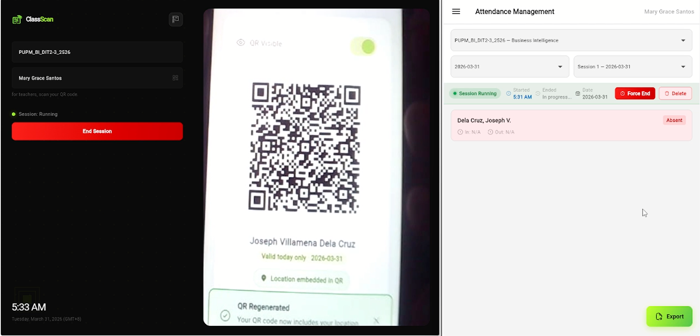 |
| 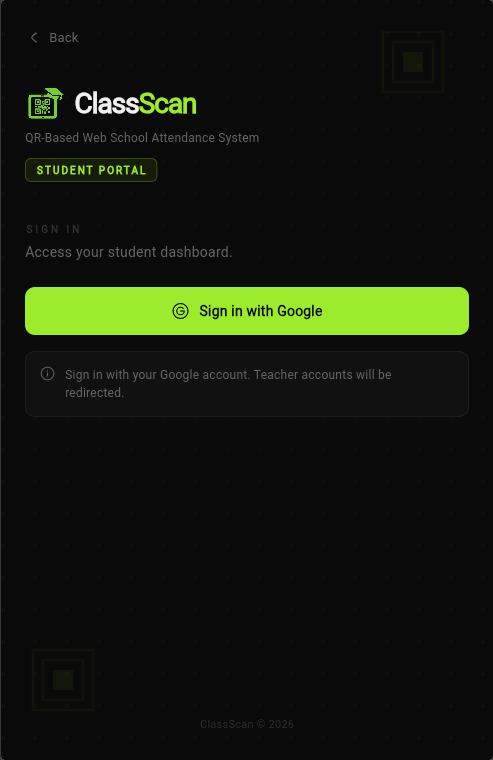 | 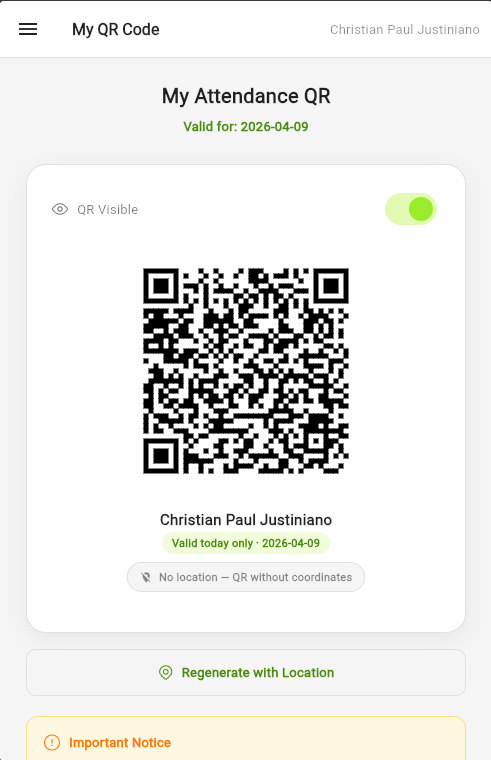 |
| 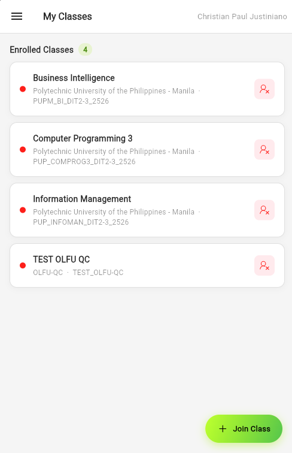 | 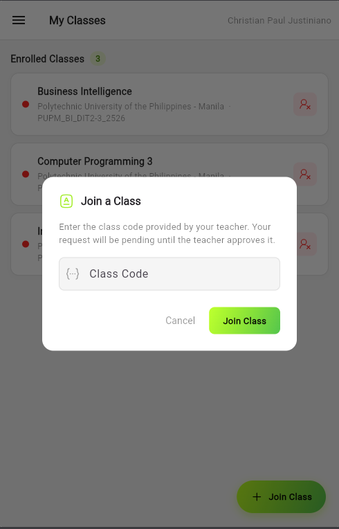 |
| 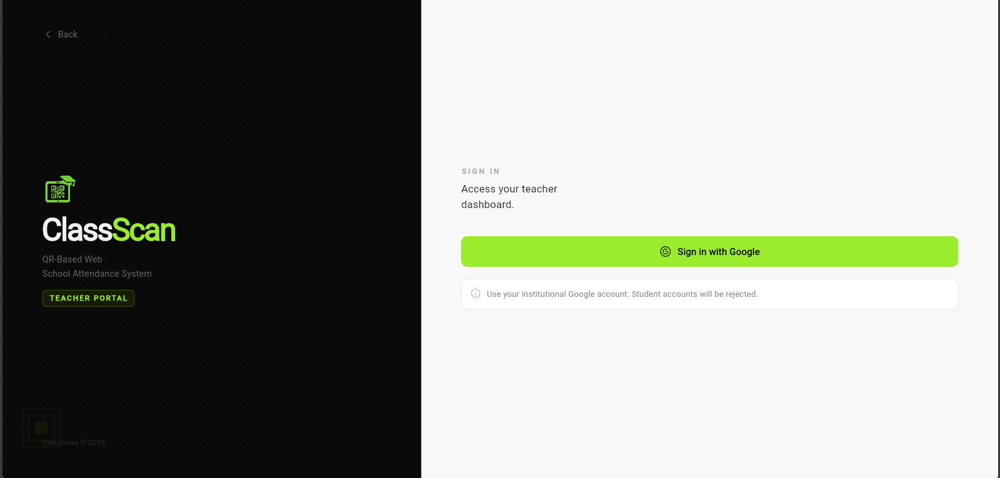 | 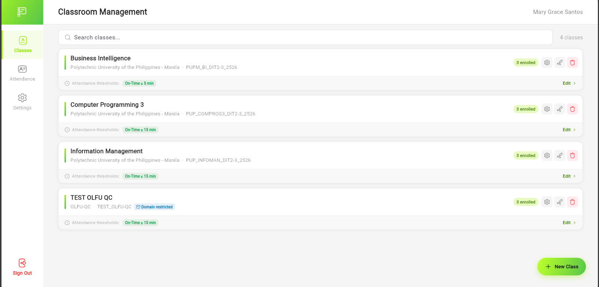 |
| 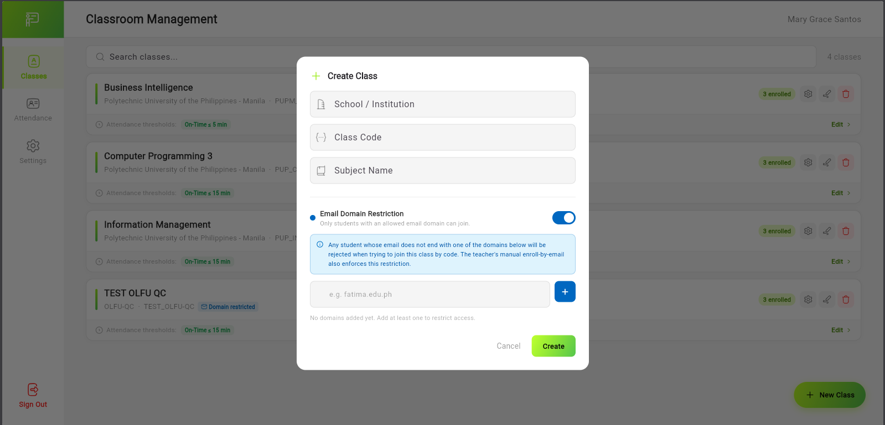 | 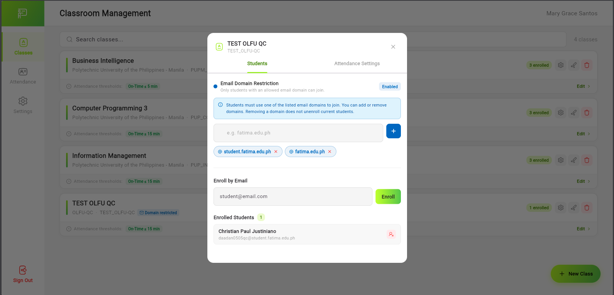 |
| 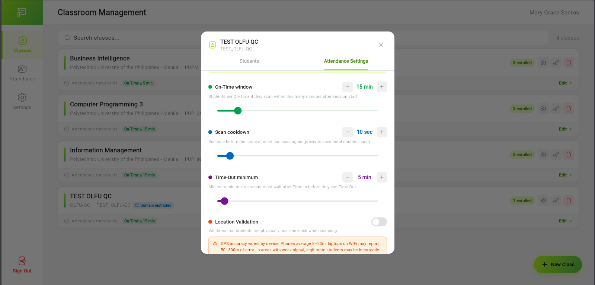 | 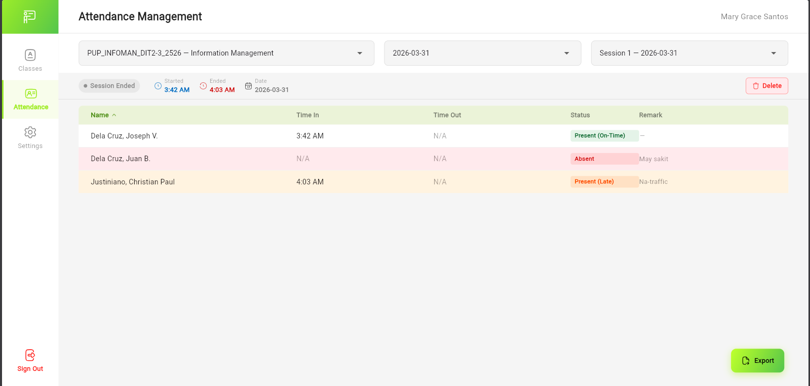 |
| 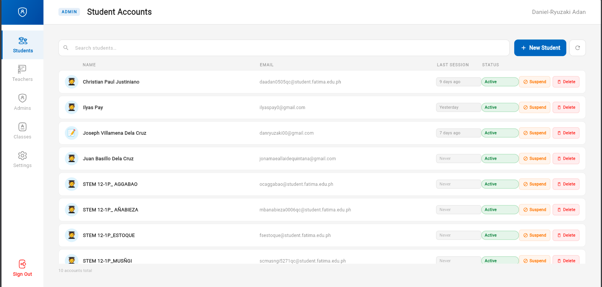 | 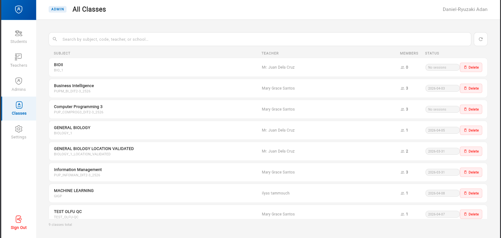 |

---

## ⚙ Getting Started

### Prerequisites
- Flutter SDK `^3.11.1`
- A Firebase project with Firestore, Authentication (Google provider), and anonymous sign-in enabled
- `flutterfire configure` run to generate `firebase_options.dart`

### Installation

```bash
# Clone the repository
git clone https://github.com/DanRyuzaki/ClassScan.git
cd ClassScan

# Install dependencies
flutter pub get

# Run on web (Chrome)
flutter run -d chrome
```

### Build for Production

```bash
flutter build web --release
```

Deploy the contents of `build/web/` to any static hosting provider (Firebase Hosting, Vercel, Netlify, etc.).

---

## 🗎 License

This project is licensed under the **Apache License 2.0**.  
See [LICENSE](LICENSE) for details or visit [Apache 2.0](https://www.apache.org/licenses/LICENSE-2.0).

> Free to use, modify, and distribute — with attribution. Commercial use permitted.  
> This is a non-commercial project sustained solely through voluntary donations.

---

## ✉︎ Contact

**SoliDeoCode**
- GitHub: [@DanRyuzaki](https://github.com/DanRyuzaki)
- Facebook: [@SoliDeoCode](https://www.facebook.com/SoliDeoCode)
- Portfolio: [danryuzaki.is-a.dev](https://danryuzaki.is-a.dev)

**ClassScan Support**
- Website: [classscan.web.app](https://classscan.web.app)

---

<div align="center">

*Soli Deo Gloria · ClassScan © 2026*

<p align="center">
  <a href="https://www.buymeacoffee.com/danryuzakic" target="_blank">
    
  </a>
</p>

</div>

